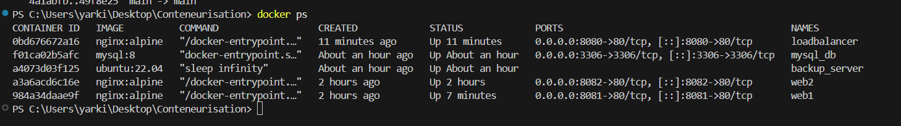
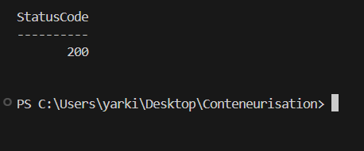
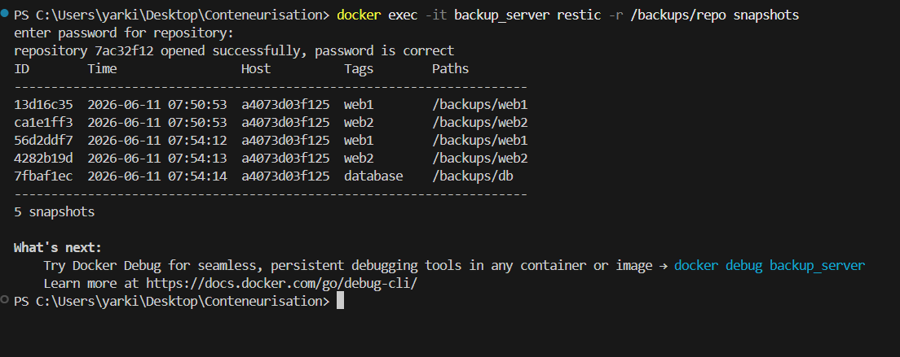
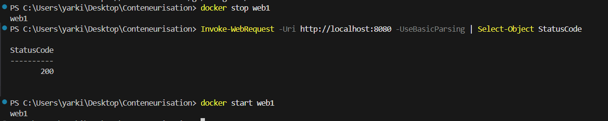

# Projet Conteneurisation B2

Mise en place d'une infrastructure conteneurisée avec Docker, incluant des serveurs web, une base de données, un système de sauvegarde et un load balancer.

---

## Architecture

```
                        ┌─────────────────┐
                        │  Load Balancer  │
                        │  (Nginx :8080)  │
                        └────────┬────────┘
                                 │
               ┌─────────────────┴─────────────────┐
               │                                   │
        ┌──────┴──────┐                   ┌────────┴────┐
        │    web1     │                   │    web2     │
        │ (Nginx:8081)│                   │ (Nginx:8082)│
        └─────────────┘                   └─────────────┘
               │                                   │
               └─────────────────┬─────────────────┘
                                 │
                        ┌────────┴────────┐
                        │    mysql_db     │
                        │  (MySQL:3306)   │
                        └─────────────────┘
                                 │
                        ┌────────┴────────┐
                        │ backup_server   │
                        │ (Restic + cron) │
                        └─────────────────┘
```

---

## Conteneurs

| Nom | Image | Port | Rôle |
|---|---|---|---|
| web1 | nginx:alpine | 8081 | Serveur web 1 |
| web2 | nginx:alpine | 8082 | Serveur web 2 |
| mysql_db | mysql:8 | 3306 | Base de données |
| backup_server | ubuntu:22.04 | - | Sauvegardes Restic |
| loadbalancer | nginx:alpine | 8080 | Reverse proxy / load balancer |

---

## Captures d'écran

### 1. Conteneurs en cours d'exécution


### 4. Load Balancer (port 8080)


### 5. Snapshots Restic


### 6. Test de panne — service toujours disponible (HTTP 200)


---

## Étapes réalisées

### Étape 1 – Infrastructure de base
- Deux serveurs web Nginx affichant chacun une page différente
- Base de données MySQL avec la table `utilisateurs` et 3 entrées
- Vérification de la connectivité web → DB

### Étape 2 – Serveur de sauvegarde
- Conteneur dédié avec **Restic** installé
- Script `/backups/backup.sh` sauvegardant web1, web2 et la DB (via `mysqldump`)
- Planification automatique via **cron** (tous les jours à 02h00)

### Étape 3 – Sécurisation des sauvegardes
- Chiffrement natif Restic avec mot de passe (AES-256)
- Permissions du dépôt restreintes (`chmod 700 /backups/repo`)
- Transferts sécurisés via le réseau interne Docker (isolé du réseau externe)

### Étape 4 – Résilience avec Load Balancer
- Nginx configuré en reverse proxy entre web1 et web2
- Répartition de charge automatique (`upstream` Nginx)
- Si un serveur tombe, le trafic est redirigé vers l'autre automatiquement

### Étape 5 – Test de panne
- Arrêt de web1 → service toujours disponible via web2
- **RTO ≈ 0 secondes** (aucune interruption visible)
- **RPO = dernière sauvegarde cron** (max 24h de données)
- Test de restauration : snapshots Restic vérifiés et listés

---

## Démarrage rapide

```bash
# Cloner le repo
git clone https://github.com/YarkinOner/Conteneurisation.git
cd Conteneurisation

# Lancer tous les conteneurs
docker compose up -d

# Vérifier que tout tourne
docker ps
```

Accès :
- http://localhost:8080 → Load balancer (web1 ou web2)
- http://localhost:8081 → Web 1 direct
- http://localhost:8082 → Web 2 direct

---

## Sauvegardes

```bash
# Lancer une sauvegarde manuelle
docker exec -it backup_server /backups/backup.sh

# Lister les snapshots
docker exec -it backup_server restic -r /backups/repo snapshots
```

Mot de passe du dépôt Restic : `backup1234`

---

## Structure du projet

```
Conteneurisation/
├── docker-compose.yml      # Définition de tous les services
├── nginx.conf              # Config du load balancer
├── failover_test.sh        # Script de test de panne
├── web1/
│   └── index.html          # Page du serveur web 1
└── web2/
    └── index.html          # Page du serveur web 2
```

---

## Améliorations possibles

- **Monitoring** : Ajouter Prometheus + Grafana pour surveiller les conteneurs
- **Alerting** : Notifications en cas de panne (email, Slack)

- **HTTPS** : Ajouter des certificats TLS sur le load balancer

- **Dockerfile custom** : Créer une image backup avec Restic pré-installé pour éviter la réinstallation à chaque redémarrage
---

Yarkin ONER